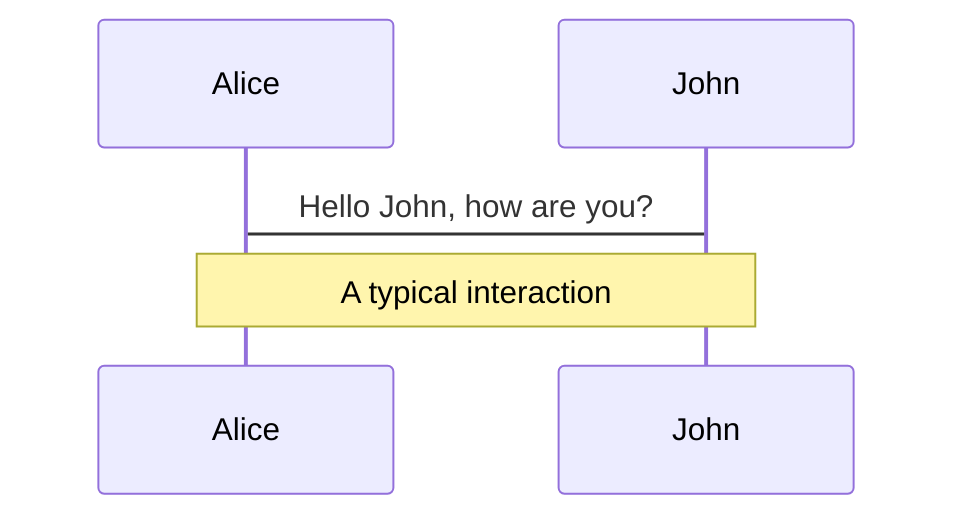
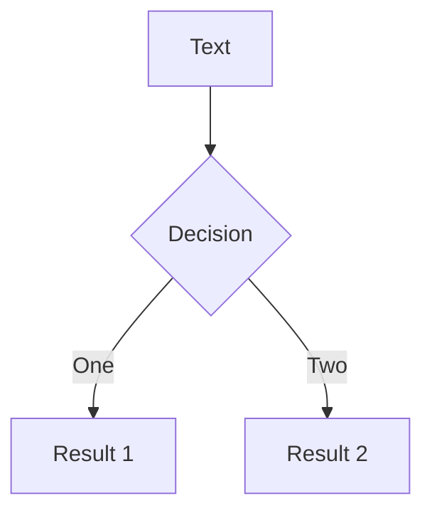
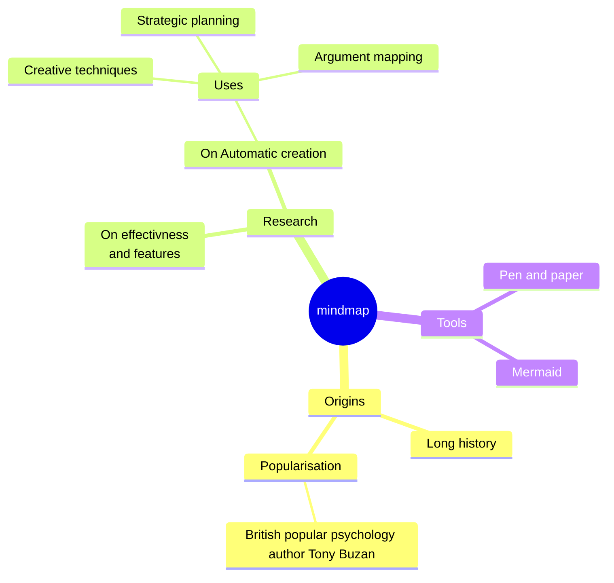
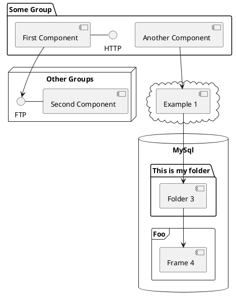

# Datenbank Cluster
## FeTS Team 2

<!-- <div class="pt-12">
  <span @click="$slidev.nav.next" class="px-2 py-1 rounded cursor-pointer" hover="bg-white bg-opacity-10">
    Weiter <carbon:arrow-right class="inline"/>
  </span>
</div> -->

<div class="abs-br m-6 flex gap-2">
  <button @click="$slidev.nav.openInEditor()" title="Open in Editor" class="text-xl slidev-icon-btn opacity-50 !border-none !hover:text-white">
    <carbon:edit />
  </button>

  <!--
  ADD LINK TO REPO IN GITHUB LATER
  -->
  <a href="https://github.com/slidevjs/slidev" target="_blank" alt="GitHub" title="Open in GitHub"
    class="text-xl slidev-icon-btn opacity-50 !border-none !hover:text-white">
    <carbon-logo-github />
  </a>
</div>

<!--
The last comment block of each slide will be treated as slide notes. It will be visible and editable in Presenter Mode along with the slide. [Read more in the docs](https://sli.dev/guide/syntax.html#notes)
-->

---
transition: fade-out
---

# Einführung

*Im Rahmen der Veranstaltung "Fehlertolerante Systeme" von Prof. Classen gibt es die Aufgabe ein laufendes Mini-Projekt zu entwickeln.*
<br> <br>

- 🎯 **Ziele**
  - Laufendes DB-Cluster
  - Verfügbarkeit der Daten in der DB
<br>

- 🪳 **CockroachDB** 
      - verteilte SQL-Datenbank, die auf Skalierbarkeit und Zuverlässigkeit ausgelegt ist

- ⚙️ **Aufbau** 
<br>
<br>

<style>
h1 {
  background-color: #2B90B6;
  background-image: linear-gradient(45deg, #4EC5D4 10%, #146b8c 20%);
  background-size: 100%;
  -webkit-background-clip: text;
  -moz-background-clip: text;
  -webkit-text-fill-color: transparent;
  -moz-text-fill-color: transparent;
}
</style>

---
layout: image-right
image: https://source.unsplash.com/collection/94734566/1920x1080
---

# Aufbau des Clusters
*Initialisieren der Knoten*

```bash {all|5,6|2-4|all} twoslash
cockroach start \ 
--insecure \ 
--advertise-addr= 10.0.2.15 \ 
--join= 10.0.2.15,10.0.2.14 \ 
--cache=.25 \
--max-sql-memory=.25 \ 
--background
```

<style>
.footnotes-sep {
  @apply mt-20 opacity-10;
}
.footnotes {
  @apply text-sm opacity-75;
}
.footnote-backref {
  display: none;
}
</style>

---
layout: image-right
image: https://source.unsplash.com/collection/94734566/1920x1080
---

# Aufbau des Clusters 2
*Initialisieren des Clusters*

```bash
cockroach init \
--insecure \
--host=10.0.2.15
```

<style>
.footnotes-sep {
  @apply mt-20 opacity-10;
}
.footnotes {
  @apply text-sm opacity-75;
}
.footnote-backref {
  display: none;
}
</style>
<br>

*Ports:*
- [WebInterface:](http://localhost:8080) 8080
- **Nodes:** 26257

---

# Themes

Slidev comes with powerful theming support. Themes can provide styles, layouts, components, or even configurations for tools. Switching between themes by just **one edit** in your frontmatter:

<div grid="~ cols-2 gap-2" m="t-2">

```yaml
---
theme: default
---
```

```yaml
---
theme: seriph
---
```


</div>

Read more about [How to use a theme](https://sli.dev/themes/use.html) and
check out the [Awesome Themes Gallery](https://sli.dev/themes/gallery.html).

---
preload: false
---

# Diagrams

You can create diagrams / graphs from textual descriptions, directly in your Markdown.

<div class="grid grid-cols-4 gap-5 pt-4 -mb-6">









</div>

[Learn More](https://sli.dev/guide/syntax.html#diagrams)

---
src: ./pages/multiple-entries.md
hide: false
---

---
layout: center
class: text-center
---

# Learn More

[Documentations](https://sli.dev) · [GitHub](https://github.com/slidevjs/slidev) · [Showcases](https://sli.dev/showcases.html)
